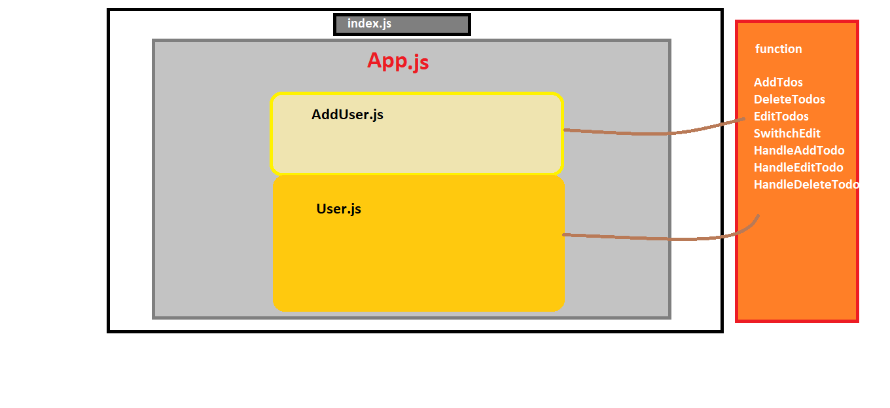

### TODO LIST app by api fetching

## features

- Add new todos 
- Delete todos  by post method
- Edit on dummy call ny put method
- Check and uncheck yours todos which is complited
- Easily you can add new todo

## This app is component based
- public
- src
- - componnents
- - - AddUser.js
- - - User.js
- - - User.css
- - App.css
- - pp.js
- - index.css
- - index.js
- - .gitignore
- - package-lock.js
- - package.json
- - README.md

## components

## live hosted
- https://fahad123k.github.io/todo-api

## github repo 
- https://github.com/Fahad123k/todo-api/tree/master